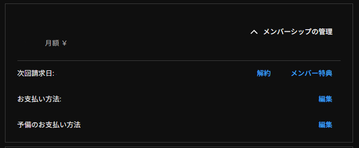

# Youtube メンバーシップ認証bot
### Youtubeのメンバーシップを認証して専用ロールを付与するbotです。

- ### 準備
　.envに以下の情報を書き込んでください。
> Discordのbotトークン、Gemini APIキー、MongoDBのURI、

　main.pyをメモ帳やVSCodeで開いて設定を変更してください。

> TARGET_ROLE_NAME：ロール名

> TARGET_CHANNEL：Youtubeのチャンネル名

> GUILD_ID：DiscordのサーバーID

- ### 起動
　pythonでmain.pyを実行してbotを起動してください。

- ### 認証するには
　/verifyコマンドで認証できます。スクリーンショットを添付して送信してください。

　スクリーンショットの例:

- ### 注意
メンバーシップの有効期限が切れるとロールが剝奪されます。
